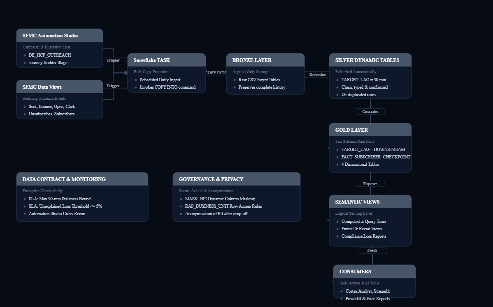
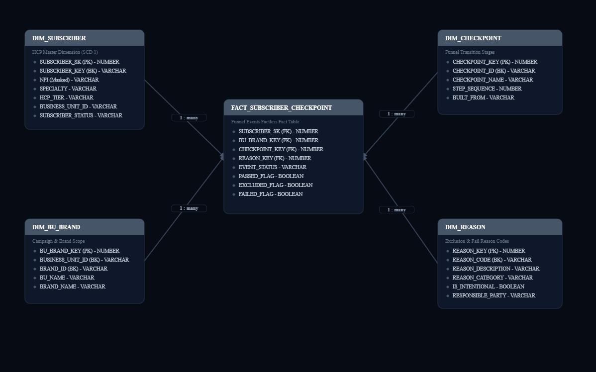
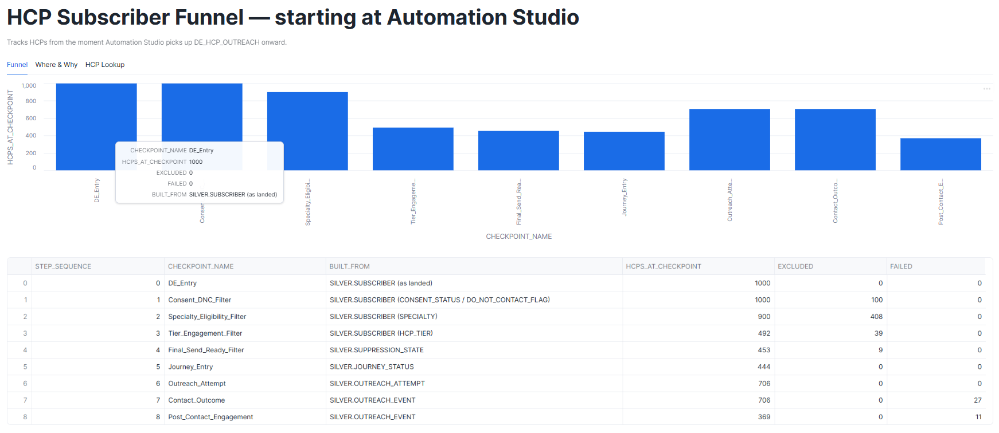
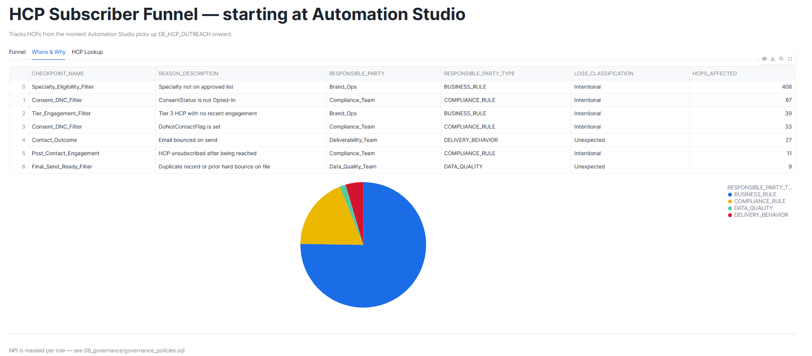

# SFMC_INTELLIGENCE_POC

A Snowflake Medallion pipeline (Bronze → Silver → Gold → Semantic) built on
a synthetic, SFMC-modeled HCP outreach dataset, with Cortex Analyst and
Streamlit as the reporting layer on top. Built for a Life Sciences / HCP
email outreach use case.

---

## Overview

Pharma marketing teams run HCP (Healthcare Provider) outreach through
Salesforce Marketing Cloud: Automation Studio applies a chain of
eligibility filters to a Data Extension, Journey Builder enrolls the
survivors, and Email Studio sends the outreach. At every stage, HCPs drop
out — but Automation Studio's own audit log only reports aggregate counts
("300 excluded"), never which specific HCP was excluded or why. There's
been no reliable, governed place to answer "why did our count drop from
1,000 to 700 by the time we sent the email."

This project builds that place: a governed data product on Snowflake that
turns raw SFMC-style eligibility and engagement events into a single,
row-level record of what happened to every HCP, at every stage, with a
named reason and an accountable team attached to every drop-off — plus a
Cortex Analyst semantic model and a Streamlit dashboard so the numbers are
usable without writing SQL.

---

## System Architecture



Data flows through four stages, each doing one clearly-scoped job:

- **Bronze** — raw data, captured exactly as it arrived from SFMC. No
  cleaning, no judgment calls.
- **Silver** — typed and conformed as Dynamic Tables, refreshing
  automatically (`TARGET_LAG = 30 minutes`) instead of on a manually
  scheduled batch job.
- **Gold** — a star schema: one fact table
  (`FACT_SUBSCRIBER_CHECKPOINT`) at HCP-per-checkpoint grain, four
  dimensions, surrogate keys, and an "unknown member" fallback row
  (`-1`) on every dimension so a fact row can never silently fail to join.
- **Semantic** — a thin, business-facing view layer on top of Gold; this
  is the only supported consumer interface — nobody queries Gold
  directly.

---

## End-to-End Data Flow

1. **Data generation** — a script generates synthetic HCP, Automation
   Studio activity log, Journey Builder status, and event
   (sent/open/click/bounce/unsubscribe) data modeled on SFMC's real Data
   View schema, seeded with realistic exclusion rates at each eligibility
   stage.
2. **Load to Bronze** (`bronze_ingest.sql`) — a stored procedure loads all
   10 source files into typed raw tables, with a load-audit row per file
   so a partial or failed load is visible immediately.
3. **Silver transformation** (`silver_transform.sql`) — six Dynamic
   Tables conform and type the Bronze data: subscriber attributes, the
   Automation Studio activity log, journey status, suppression state,
   outreach attempts, and a unified outreach-event table.
4. **Gold modeling** (`gold_dimensions_and_fact.sql`) — four dimensions
   and a single fact table, built as a Dynamic Table defined by one CTE
   chain (one CTE per funnel checkpoint, unioned once at the end).
5. **Semantic layer** (`semantic_views.sql`) — a funnel view, a
   reconciliation view, a Compliance-only view, a Brand-Ops-only view, a
   single-HCP lineage lookup, and a plain-English executive summary — all
   computed from the same base fact.
6. **Cortex Analyst & Streamlit** (`streamlit_app.py`) — the semantic
   views are exposed for natural-language querying and visual reporting.

---

## Project Structure

```
hcp-subscriber-funnel/
├── setup.sql                     # Warehouse, database/schemas, stage, file format
├── bronze_ingest.sql              # Raw table DDL + SP_LOAD_HCP_FILES() + the daily Task
├── silver_transform.sql          # Six Dynamic Tables: conform, type, de-duplicate
├── gold_dimensions_and_fact.sql  # Star schema: 4 dimensions + the single fact Dynamic Table
├── semantic_views.sql             # Funnel, reconciliation, compliance, brand-ops, lineage, exec summary
├── governance_policies.sql       # NPI masking, BU/Brand row access, retention/anonymization
├── data_contract.yaml             # Freshness/quality SLAs, versioning policy, consumers, changelog
├── observability.sql              # Freshness, Dynamic Table lag, quality SLA, usage tracking checks
├── reconciliation.sql             # Legacy — see Known Limitations below. Not part of the run order.
├── streamlit_app.py                # Funnel / Where & Why / HCP Lookup dashboard
├── .gitignore
└── README.md                       # This file
```

_(If you're also keeping the Cortex Analyst semantic model, architecture
diagrams, or the full DMDD/DPDD design docs, they slot in as
`semantic_model.yaml`, `diagrams/`, and `docs/` respectively — not
pictured above since they weren't in the latest commit.)_

---

## Data Model (ERD)



**Business keys vs. surrogate keys:** every dimension carries both a
business key (the real SFMC identifier, e.g. `SUBSCRIBER_KEY`) and a
surrogate key (`SUBSCRIBER_SK`). Surrogate keys decouple Gold from SFMC's
own key management — if a `SubscriberKey` were ever reused for a
different HCP, Gold's join integrity wouldn't depend on that never
happening.

**Unknown-member row:** every dimension has one reserved row with
surrogate key `-1`. If a fact row's business key can't be matched to a
real dimension member, it resolves to this fallback row instead of a
`NULL` key or a silently dropped row — an unresolved HCP is a data
quality signal to investigate, not a row that's allowed to just vanish
from a report.

**Why `FACT_SUBSCRIBER_CHECKPOINT` has no numeric measure column:** it's a
_factless fact table_ — the measurement is the row's existence itself
(an HCP either passed a checkpoint or didn't), not a stored number.
Numbers come from counting rows, which is exactly what `VW_HCP_FUNNEL`
and `VW_FUNNEL_RECONCILIATION` do.

---

## Setup & Run Order

```
1.  setup.sql
2.  bronze_ingest.sql
      → upload source files to @STG_HCP_LANDING, then: CALL SP_LOAD_HCP_FILES();
3.  silver_transform.sql
4.  governance_policies.sql      -- needs step 3 done first
5.  gold_dimensions_and_fact.sql
6.  semantic_views.sql
7.  streamlit_app.py              -- deploy as Streamlit in Snowflake
8.  observability.sql             -- run any time to confirm health
```

**Not part of the run order:** `reconciliation.sql` — see Known
Limitations.

---

## Reporting Layer — Cortex Analyst & Streamlit

| Surface                     | Audience                             | Purpose                                                          |
| --------------------------- | ------------------------------------ | ---------------------------------------------------------------- |
| Cortex Analyst              | Any stakeholder, natural language    | "How many HCPs were reached?" / "What are the top loss reasons?" |
| Streamlit — Funnel tab      | Brand Ops                            | Funnel-by-stage chart + reconciliation table                     |
| Streamlit — Where & Why tab | Compliance, Brand Ops                | Loss breakdown by reason, and by owning team                     |
| Streamlit — HCP Lookup tab  | Anyone investigating a specific case | Full lineage for one HCP, stage by stage                         |

---




## Known Limitations

- **`reconciliation.sql` is legacy and shouldn't be run.** An earlier
  draft of this pipeline had it rebuild a physical table,
  `FACT_FUNNEL_RECONCILIATION`, via `CREATE OR REPLACE TABLE`. That
  approach was dropped: it was a second, competing source of truth for
  numbers `FACT_SUBSCRIBER_CHECKPOINT` already owns, and nothing was
  scheduled to refresh it, so it would go stale silently. Its logic now
  lives entirely in `VW_FUNNEL_RECONCILIATION` (in `semantic_views.sql`)
  — a view, computed at query time, with no separate object that can
  drift out of sync. The file is kept in the repo for history; don't add
  it back into the run order.
- **Eligibility rules are hardcoded, not config-driven.** The approved
  specialty list and the tier/engagement rule live directly in
  `gold_dimensions_and_fact.sql`'s CTE chain. A policy change today means
  a code change, not a data change.
- **`DIM_SUBSCRIBER` doesn't track history.** If an HCP's tier or
  specialty is reassigned, the previous value isn't kept — a past funnel
  outcome ends up described using their _current_ attributes.
- **The dataset is synthetic** — modeled on SFMC's real Data View schema,
  seeded with plausible exclusion rates, but not real HCP behavior.
- **Loss upstream of the Data Extension is out of scope.** If a CRM/Veeva
  sync step filters an HCP before SFMC ever sees them, this product has
  no visibility into that.

---

## Notes

Built with AI assistance (Claude, Coco Snowflake Assistant) for pipeline design, SQL, architecture
diagrams, and documentation — reviewed and iterated on throughout,
including catching and fixing real issues along the way: a
case-sensitivity bug where quoted mixed-case columns didn't match
unquoted raw SQL elsewhere in the pipeline; a scheduled Task that
silently loaded only 1 of 10 source files; a Dynamic Table lag setting
with nothing downstream to cascade from; and the reconciliation table
described above, which had quietly reappeared in a later edit before
being caught and removed again. Full details are in
`data_contract.yaml`'s changelog.
